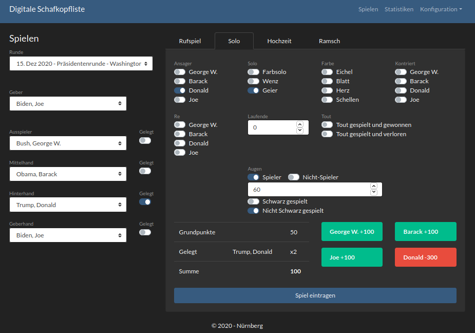

# Schafkopf-Application
[](https://github.com/PanchoVarallo/Schafkopf-Application/actions/workflows/build.yml)

[Schafkopf](https://en.wikipedia.org/wiki/Schafkopf) is the most popular card game in Bavaria. 

With this application, 
you can record results of your physical [Schafkopf](https://en.wikipedia.org/wiki/Schafkopf) round in an 
[SQLite](https://www.sqlite.org/index.html) database.  

Why should I do this instead of using pen and paper? 
- The `Schafkopf-Application` calculates the results immediately.
- You can access wonderful graphs illustrating the results.
- You can access comprehensive stats analyzing gaming behavior of the players.
- You have a database with all the results for doing further analysis.

## Preview


## Installation

The `Schafkopf-Application` was created with Python and the [Dash](https://dash.plotly.com/) framework. 
You can run the application locally and access it via your browser:

1. Clone `Schafkopf-Application` and go to the `schafkopf` directory.
2. Create a `conda` environment with Python version `~=3.8.4`
```
conda create -n "schafkopf" python~=3.8.4 ipython
```
and run
```
conda activate schafkopf
pip install -r requirements.txt
```
3. Run `python init.py` to init the schema in the [SQLite](https://www.sqlite.org/index.html) 
database called `schafkopf.db`.
4. Start the application with `python -m app`.
5. Go to a browser and type in `http://127.0.0.1:8050/`.

## Implemented rules

We play `Rufspiel`, `Solo`, `Ramsch`, and `Hochzeit`, which is basically the used configuration in the small villages 
in the north-eastern region of Nürnberg. The calculation is based on the rules 
of [Sauspiel - Spielabrechnung](https://www.sauspiel.de/schafkopf-lernen/spielabrechnung).


    

